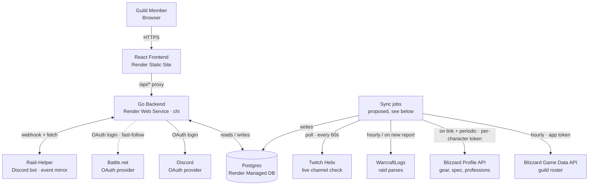

# Fuzion Guild Portal — Build Spec

A build spec for a semi-hardcore guild's home base: roster, raid progress, crafting, PvP, recruiting, and streams — backed by Battle.net/Discord login and live data from Blizzard, WarcraftLogs, and Twitch.

|                   |                                        |
| ----------------- | -------------------------------------- |
| **Game**          | World of Warcraft: Forever             |
| **Guild**         | Fuzion                                 |
| **Guild focus**   | Raiding, dungeons, crafting, community |
| **Target launch** | ~4 weeks (with game launch)            |
| **Stack**         | Go (chi) + React/TS + Postgres — see [project-structure.md](project-structure.md) |
| **Hosting**       | Render (static site + web service + managed Postgres) |

> Risk scale used throughout this doc (borrowed from WoW's own item-quality scale): **UNCOMMON** = fully in our control · **RARE** = standard, low risk · **EPIC** = core, moderate risk · **LEGENDARY** = depends on a third party supporting a day-one game · **POOR** = deferred.

## Contents

- [Fuzion Guild Portal — Build Spec](#fuzion-guild-portal--build-spec)
  - [Contents](#contents)
  - [1. Overview](#1-overview)
  - [2. Site map](#2-site-map)
  - [3. Accounts \& identity](#3-accounts--identity)
    - [Roles: member / officer / admin](#roles-member--officer--admin)
  - [4. News \& announcements](#4-news--announcements)
  - [5. Data integrations](#5-data-integrations)
  - [6. Architecture](#6-architecture)
    - [Sync job scheduling (proposed)](#sync-job-scheduling-proposed)
  - [7. Roadmap \& risk](#7-roadmap--risk)
  - [8. Data model](#8-data-model)
  - [9. Open questions](#9-open-questions)
  - [10. Next steps](#10-next-steps)

## 1. Overview

The site is the guild's operations hub, not just a brochure. It needs to serve three audiences at once: applicants deciding whether to join, members managing their own characters and raid signups, and officers running roster, recruitment, and events. Because **Forever** launches in roughly a month, this spec splits work into what we build with data we control from day one, and what depends on third-party APIs that may not support a brand-new game immediately — see [Roadmap & risk](#7-roadmap--risk).

Guild name used throughout this spec: **Fuzion**, realm `Emberreach`, region `us` — realm and region are placeholders until the guild is planted at launch.

## 2. Site map

| Page                       | Purpose                                                                                                                                                                                | Access                                             |
| -------------------------- | -------------------------------------------------------------------------------------------------------------------------------------------------------------------------------------- | -------------------------------------------------- |
| **Home**                   | Latest & pinned news, hero widget (next raid countdown, raid progress, and recruitment could rotate through one shared hero slot), live stream shown only when someone's actually live | Public                                             |
| **News**                   | Full news history/archive, filterable by category                                                                                                                                      | Public                                             |
| **Roster**                 | Full guild roster synced from the Blizzard API; filter by class, role, main/alt, raid team — class/level/rank sync day one via the app token, role/main-alt/raid-team need Battle.net linking (fast-follow, §5), officer-entered until then | Public                                             |
| **Raid Progress**          | Current tier progress bar, boss kill order, linked WarcraftLogs parses                                                                                                                 | Public                                             |
| **Calendar & Events**      | Mirrors Raid-Helper events & signups from Discord in real time; resolves signups to characters for raid comp view                                                                      | Public (view) · created via Raid-Helper in Discord |
| **Applications**           | Recruiting form (class/role/availability); submission posts a notification to a Discord recruiting channel; officer review queue                                                     | Public form / Officer review                       |
| **Professions & Crafting** | Searchable directory: who crafts what, at what skill level — synced per character via the Blizzard Profile API (§5) for linked characters, officer-entered otherwise                  | Public                                             |
| **PvP**                    | Rated BG ratings pulled from the Blizzard API, guild leaderboard. Optional: may not be included, depending on guild interest                                                           | Public                                             |
| **Streams**                | Grid of member Twitch/YouTube channels; featured "who's live" widget                                                                                                                   | Public                                             |
| **Member Dashboard**       | Manage linked characters/alts, notification prefs, stream channel                                                                                                                      | Members                                            |
| **Officer Console**        | Manual roster & profession edits, application review, event management, news editor, sync health — admins additionally get a members/permissions panel (officer and admin grants) | Officers (admin panel: Admins only)                |

> **Home hero widget:** a raid isn't always imminent and no one's always live, so the Home page's top hero slot is a candidate for a rotating widget that cycles between Next Raid countdown, Raid Progress (current tier boss-kill order), and a Recruitment call-to-action, rather than hard-coding the countdown as the permanent hero. The live-stream widget correspondingly moves to a secondary spot (sidebar card or floating corner widget) and only renders when someone's actually streaming. Not yet a final decision.

> **Applications → Discord notification:** submitting the recruiting form writes an `Application` row (status `pending`) and separately fires an outbound webhook posting a summary (class/role/availability) to a specific Discord recruiting channel — the same one-way outbound-webhook shape as the News cross-post (§4), not a hosted bot, so it needs no OAuth and carries only RARE risk (§7). A failed Discord post shouldn't fail the submission — the application is still saved; the notification is a best-effort mirror of it. The **officer review queue**, however, needs officer auth to gate it: that's satisfiable by Discord login alone once an admin grants `is_officer` manually (§3), with no dependency on the Blizzard roster sync (LEGENDARY risk).

## 3. Accounts & identity

Auth goes through the backend's `internal/auth` package ([project-structure.md](project-structure.md) §Auth): a provider-agnostic interface (`AuthURL(state)`, `Exchange(ctx, code)`) so a second provider is a new implementation, not a rewrite.

- **Discord** (launch) — the only provider at launch ([project-structure.md](project-structure.md) decision 2); matches how the guild already communicates day to day, and lets the site gate access on guild-server membership at the session layer.
- **Battle.net** (fast-follow) — added later as a second `Provider` implementation. Once it lands, it proves character ownership: the returned profile token lets the app call the member's own `/profile/user/wow` endpoints for their character list on the guild's realm. This is also what unlocks self-service character claiming — after Battle.net login, the app lists a member's characters on `Emberreach` and lets them tag one as **main**, the rest as **alts**, and assign a raid team.

A member will eventually be able to link both to one account. This project needs its own admin-level Blizzard app credentials for the background guild-roster sync (§5) — membership only (name, class, level, rank). Gear, spec, and professions aren't part of that roster call at all; Blizzard only exposes those through the per-character Profile API, authorized by that character's own linked OAuth token — the same token granted during character claiming, not the app-level credential. So gear/spec/professions can only ever be synced for characters whose owner has linked Battle.net; there's no guild-wide equivalent.

> **Fallback:** officers can hand-add or correct any character in the Officer Console without requiring the owner to link Battle.net. This is the *only* path for character data at launch, since Battle.net linking is fast-follow, and it remains available afterward for members who'd rather not link at all.

### Roles: member / officer / admin

> **Decision (#6):** officer status is granted manually by admins, not derived from in-game guild rank. Revocation would lag behind the roster sync (someone removed after an incident could keep access until the next run), not every in-game officer wants site access, tying site permissions to a Blizzard rank widens the attack surface, and it couples permissions to Blizzard's API (and to WoW specifically). Roles change rarely in a guild this size, so the automation buys little. Guild rank from the roster sync (§5) is display data only. This can be revisited later.

- **`is_officer`** (boolean): fully manual, granted and revoked by admins in the Officer Console's admin panel. Defaults to `false`, so every member starts as a non-officer until an admin grants access. Requires a Discord-linked account, which every user has at launch.
- **`is_admin`** (boolean): fully manual, granted by an existing admin. Admins get officer-level access regardless of their own `is_officer` value, plus the members/permissions panel.
- Effective permission: `isOfficer() = is_admin || is_officer`; admin-only actions check `is_admin` alone.
- Neither flag is ever written by a sync job, so the roster sync has no way to grant or revoke site access.

## 4. News & announcements

Home shows the three most recent posts, pinned posts first; the dedicated **News** page is the full paginated history, filterable by category.

| Category      | Typical post                                                            | Author  |
| ------------- | ----------------------------------------------------------------------- | ------- |
| Guild News    | Recruitment pushes, roster milestones, officer announcements            | Officer |
| Raid Progress | Boss kills, tier clears, progression recaps                             | Officer |
| Recruitment   | Open roles, application deadlines                                       | Officer |
| Patch Notes   | Summaries of Blizzard patch notes relevant to the guild's classes/specs | Officer |

The feed is entirely manual — every post is written by an officer or admin, including boss-kill recaps. There's no auto-drafting from WarcraftLogs or the Blizzard sync; that removes a LEGENDARY-risk dependency (§7) from the critical path and replaces it with something officers already do informally in Discord (post a kill screenshot with a caption), just formalized on the site.

**Editor:** officers and admins write posts in [`@uiw/react-md-editor`](https://github.com/uiwjs/react-md-editor) (its `/nohighlight` entry point — the default entry bundles a full Prism syntax highlighter that's dead weight for prose news posts and nearly 3x the size). Decided in issue #9 after a throwaway spike comparing it against a plain textarea + `react-markdown`, `@mdxeditor/editor`, and CodeMirror 6: its built-in toolbar (bold/italic/lists/image insert, etc.) doesn't require officers to know Markdown syntax, unlike a bare textarea or `@mdxeditor/editor`'s minimal bar, and at ~123 KB gzip (nohighlight) it's far lighter than `@mdxeditor/editor`'s ~422 KB for comparable capability. It also renders image size overrides out of the box (bundled `rehype-attr`/`rehype-raw`), if that's ever needed. Behavior below is a requirement the integration must satisfy.

- **Images:** an upload control inserts standard Markdown image syntax (``). Images are stored in Postgres (decided in issue #7): the upload handler re-encodes each image to WebP as a full-size variant (2560 px long edge, quality 90) and a thumbnail (800 px, quality 80), served from `/api/images/{id}` and `/api/images/{id}/thumb`. Markdown only ever holds `/api/images/{id}`. On render, the Markdown-to-HTML pipeline rewrites each image into a lazy-loaded thumbnail wrapped in a link to the full-size image, which opens in a lightbox/modal — enough for boss-kill screenshots without pulling in a heavy JS dependency.
- **Autosave:** while editing a draft, changes save periodically (debounced a few seconds after the user stops typing) via a background API call, with no explicit "Save" click needed. Publishing stays an explicit, separate action.
- **Dirty check / navigation guard:** a client-side dirty flag warns on tab close/refresh via `beforeunload`, and separately intercepts in-app React Router navigation so navigating within the SPA also prompts before discarding unsaved edits — `beforeunload` alone won't catch client-side route changes.

**Discord cross-post:** publishing a post can fire an outbound webhook to the guild's Discord announcements channel — the mirror image of the inbound Raid-Helper webhook described next.

## 5. Data integrations

Each external source is polled on its own schedule and cached in Postgres, so a slow or failing API degrades to "last known good data" instead of breaking the page.

| Source                    | Feeds                                 | Example call                                                                   | Cadence                               | Launch risk |
| ------------------------- | ------------------------------------- | ------------------------------------------------------------------------------ | ------------------------------------- | ----------- |
| Battle.net OAuth          | Login, character ownership            | `oauth.battle.net/authorize`                                                   | On login                              | RARE        |
| Raid-Helper (Discord bot) | Event calendar, signups & attendance  | Webhook: `event.created`/`updated`/`deleted`, plus API fetch for signup detail | Real-time (webhook) + on-demand fetch | RARE        |
| Blizzard Game Data API (app token)     | Guild roster membership: name, class, level, rank        | `GET /data/wow/guild/{realm}/{guild}/roster`                                            | Hourly cron                    | LEGENDARY   |
| Blizzard Profile API (per-character OAuth token) | Gear, spec, professions & skill level — linked characters only | `GET /profile/wow/character/{realm}/{name}/equipment` · `/specializations` · `/professions` | On link + periodic refresh     | LEGENDARY   |
| WarcraftLogs API v2       | Raid parses, kill logs                | `POST /api/v2/client` (GraphQL)                                                | Hourly / on new report                | LEGENDARY   |
| Twitch Helix API          | Live channel detection                | `GET /helix/streams?game_id={retail_id}`                                       | Poll every 60s                        | RARE        |
| YouTube                   | Live badge (manual)                   | No reliable "live in category" filter — member self-toggles "I'm live" instead | —                                     | UNCOMMON    |

The LEGENDARY risk above is purely whether Blizzard and WarcraftLogs expose matching endpoints for Forever at launch, not execution risk on this project's side — see §6 for how the sync jobs themselves are proposed to run.

> **Raider.io is not used.** It was considered for dungeon score and PvP rating, but it is no longer needed: there will be no dungeon score to track, and PvP rating can be acquired from Blizzard (see the PvP page in §2).

**Professions & Crafting is a Profile API feed, not a Game Data API one.** Assuming Forever's Blizzard API surface matches retail and classic (both already expose `GET /profile/wow/character/{realm}/{name}/professions`), profession/skill-level data is available — but, like gear and spec, only per character and only once that character's owner has authorized the app via Battle.net (the same per-character OAuth token used for claiming, §3). There's no app-level "give me professions for the whole guild" call the way there is for guild roster membership. So the **Professions & Crafting** page (§2) is populated the same way Roster's self-service side is: automatically for linked characters, with officers able to hand-enter a character's professions in the Officer Console as the day-one fallback before Battle.net linking exists (mirroring the Roster fallback in §3).

The **Calendar** page is a mirror, not a second source of truth: officers create and edit raid events with the Raid-Helper bot in Discord as they already do, a webhook pushes each create/update/delete to the site instantly, and a follow-up API fetch resolves attendee Discord IDs (from each member's linked Discord account) to the site's characters for a proper raid comp view.

The **Streams** page's "featured live guildie" widget: streamers are expected to tag Forever content under the existing [`world-of-warcraft`](https://www.twitch.tv/directory/category/world-of-warcraft) (retail) category, since Twitch has no separate Forever category. A scheduled job resolves that game ID once (via Twitch's Get Games endpoint, cached), then polls Twitch Helix for the guild's known channel IDs (from each member's linked `StreamChannel`, §8) filtered to that category ID and `type=live`. The job caches the live list, and the featured-widget component picks one at random on each page load/refresh.

## 6. Architecture

Stack, repo layout, and testing conventions are decided in [project-structure.md](project-structure.md) — this section covers only how the external integrations from §5 fit around that.

_The React frontend only ever talks to its own origin; Render's static-site rewrite proxies `/api/*` to the Go backend ([project-structure.md](project-structure.md) decision 5), so there's no CORS or cross-subdomain cookie handling. The backend owns OAuth (Discord at launch, Battle.net fast-follow) and the Raid-Helper webhook. The read-only external sources (Blizzard, WarcraftLogs, Twitch) are pulled by separate scheduled sync jobs rather than on the request path, so a slow or failing third-party API never blocks a page load._

### Sync job scheduling (proposed)

Not yet a confirmed decision — flagged in Open Questions. Proposed default: each polled source in §5 runs as its own **Render Cron Job service**, built from `backend/` (e.g. `cmd/sync/main.go` invoking the same `internal/blizzard`-style packages the API uses), on that source's own cadence, writing results into Postgres for the API to read back. This is favored over an in-process scheduler goroutine inside the web service so a hung or slow sync run can't affect API request handling, and so each source's cadence is independently configurable in `render.yaml`.

The Blizzard **Profile API** sync (gear/spec/professions) doesn't fit that shape as cleanly, since it's per-character rather than a single guild-wide pull: an immediate sync fires when a character is first linked (a request-triggered call, not a cron job), and a periodic Cron Job separately re-syncs already-linked characters on a longer interval to catch gear/spec/profession changes.

## 7. Roadmap & risk

You asked for full-featured at launch, so that's the target below — but a brand-new game means the third-party APIs it depends on may not exist yet on day one.

**Launch (Month 1)**

- UNCOMMON — Home, Roster, News, Applications, Professions pages
- UNCOMMON — News editor: Markdown, image upload/thumbnails, autosave, dirty-check nav guard
- RARE — Discord login ([project-structure.md](project-structure.md) decision 2)
- RARE — Calendar mirrors Raid-Helper via webhook (events still created in Discord)
- RARE — News post publish → Discord announcements cross-post
- RARE — Application submit → Discord recruiting-channel cross-post
- UNCOMMON — Manual roster entry by officers (day-one safety net; only path for character data until Battle.net linking lands)
- UNCOMMON — Manual profession entry by officers (same day-one safety net, same reason — see §5)
- RARE — Twitch "who's live" widget (filtered to the retail `world-of-warcraft` category — see §5)
- LEGENDARY — Attempt: Blizzard guild-roster sync (app token), WarcraftLogs widgets

**Fast-follow (as APIs land / as scoped)**

- RARE — Battle.net OAuth + alt/character claiming ([project-structure.md](project-structure.md) decision 2)
- LEGENDARY — Automatic Blizzard guild-roster sync goes live
- LEGENDARY — Automatic Blizzard Profile API sync (gear, spec, professions) goes live per linked character — blocked on Battle.net OAuth shipping first (the RARE item above), not just on Blizzard API availability, so this can't be attempted at launch the way guild-roster/WarcraftLogs can
- LEGENDARY — Raid Progress page switches from manual entry to live WarcraftLogs data
- LEGENDARY — PvP leaderboard and tracking switch to live Blizzard data (may not be included, depending on guild interest)
- POOR — YouTube live auto-detection (deferred indefinitely; manual toggle stays)

## 8. Data model

> **Target model, not current state:** this is the intended end-state schema, not what's implemented today. The current schema (`backend/migrations/000001_init.up.sql`) has only three read-only tables — `news_posts`, `raids`, `streams` — backing the initial News/Raids/Streams pages, with no auth, roster, calendar, applications, or professions tables yet. Update this section as each entity actually lands.

Core entities, kept deliberately simple for v1 and built fresh in this project's own database:

- **User** — id, name, email, discord_id, battlenet_id, is_officer (manual, admin-granted), is_admin (manual, admin-granted)
- **Character** — id, user_id (nullable), name, realm, class, spec, role, is_main
- **RaidTeam** — id, name, raid_night_schedule
- **Event** — id, raid_helper_event_id, type, starts_at, raid_team_id — created/updated by the Raid-Helper webhook
- **EventSignup** — id, event_id, discord_user_id, character_id (resolved via linked Discord account), status
- **Application** — id, user_id (nullable — applicant likely has no account yet), character_id (nullable, same reason), applicant_name, class, role, availability, notes, status, submitted_at
- **Post** — id, author_user_id, title, body (Markdown, may embed uploaded images by `/api/images/{id}` URL), pinned, published_at
- **Image** — id, content_type, width, height, full_bytes, thumb_bytes, created_at — WebP variants stored in Postgres and served by the backend; referenced from Post bodies by `/api/images/{id}` (issue #7)
- **Topic** — id, name — many-to-many with Post; doubles as the News category system
- **Profession** — id, character_id, profession, skill_level
- **StreamChannel** — id, user_id, platform, channel_id, is_manual_live
- **SyncLog** — id, source, status, ran_at — tracks each API sync's health

## 9. Open questions

- Will Blizzard expose both the Game Data API (guild roster) and the Profile API (gear/spec/professions) for Forever at or near launch, and will realm/region slugs match retail conventions? Assumed to mirror retail/classic in shape (§5); timing for a day-one game is still unconfirmed.
- Will WarcraftLogs add Forever support on day one, in the first weeks, or not at all?
- Raid-Helper's docs site renders via JS and couldn't be fully verified by automated fetch — confirm the exact webhook payload shape and signing scheme (and whether event creation via API exists on a paid tier) directly in a browser before building the integration.
- Should admin changes to `is_officer` / `is_admin` be logged/audited? Deferred for now, not blocking launch.
- Sync job scheduling mechanism: §6 proposes Render Cron Job services per source; not yet confirmed.
- Discord webhook URL(s) for the Applications recruiting-channel cross-post (§2): same channel/webhook as the News cross-post, or a separate one? Needs a webhook URL created in the target Discord server either way, stored as an env var (never committed).

## 10. Next steps

1. Scaffold the repo per [project-structure.md](project-structure.md)'s layout (`frontend/`, `backend/`, `e2e/`, `docker-compose.yml`, `render.yaml`); ship manual-entry Roster and Calendar first, since those don't depend on any external API.
2. Wire up Discord OAuth (`internal/auth`) and the guild-membership session gate.
3. Register a Raid-Helper webhook endpoint (verify signatures) and map Discord user IDs to site accounts so signups resolve to characters.
4. Stand up the three Render services from `render.yaml` (static site, web service, managed Postgres) and confirm the `/api/*` proxy and the GitHub Actions test gate are green before the first real deploy.
5. Build each sync job (Blizzard, WarcraftLogs, Twitch) behind a feature flag that no-ops gracefully until that source confirms Forever support.
6. Add Battle.net OAuth + character claiming once scoped (fast-follow, [project-structure.md](project-structure.md) decision 2).

---

_Working spec — update as Blizzard, WarcraftLogs, and Twitch confirm support for World of Warcraft: Forever._
